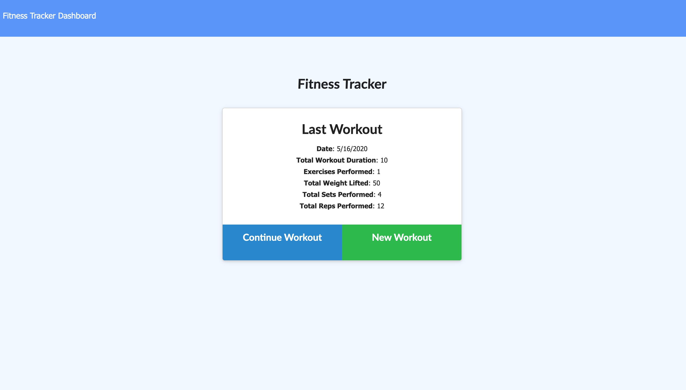
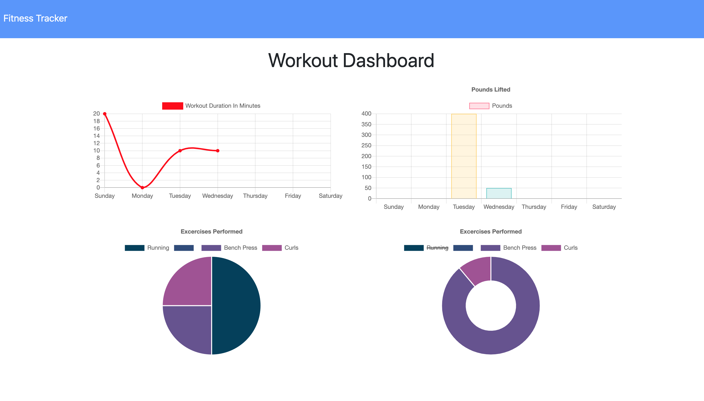
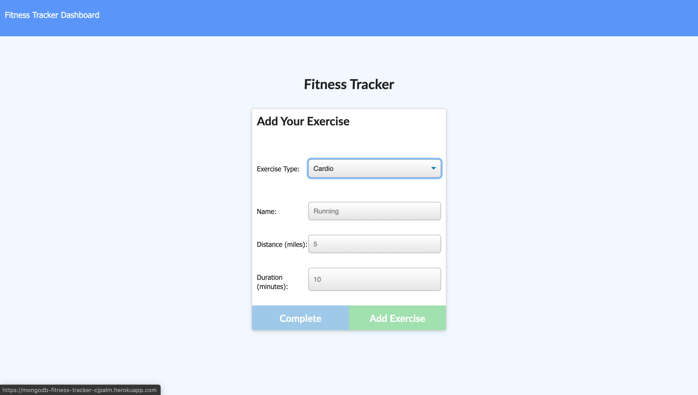

# MongoDB Fitness Tracker

## #https://mongodb-fitness-tracker-cjpalm.herokuapp.com/?id=5ec001cb8ff40d0017cb66d0

## Description

Keeping track of your physical health is incredibly important, and with this MongoDB Fitness Tracker, you'll be able to do just that! Add all the exercises you've been doing and check out all the hard work you've put in on the dashboard!

### Table of Contents

[Installation](#installation) | 
[Usage](#usage) | 
[License](#license) | 
[Questions](#questions) | 
[Contribution](#contribution) |

### Installation

Packages used Express, Mongoose, Morgan and Routes. Check out the deployment route to use on your system, no installation needed. 

### Usage

When you visit the app, you can see your last workout on the homepage. From there you can either check out your fitness progress by clicking on the dashboard option in the navbar, or you can add a resistance or cardio workout. Keep adding your workouts and watch the graphs grow with more and more data. 

### License

### Contribution

The front end of this homework assignment was provided fro the class repo, my assignment was to build all of the routing and schema on the backend.

### Questions

### cjpalmerin@gmail.com

